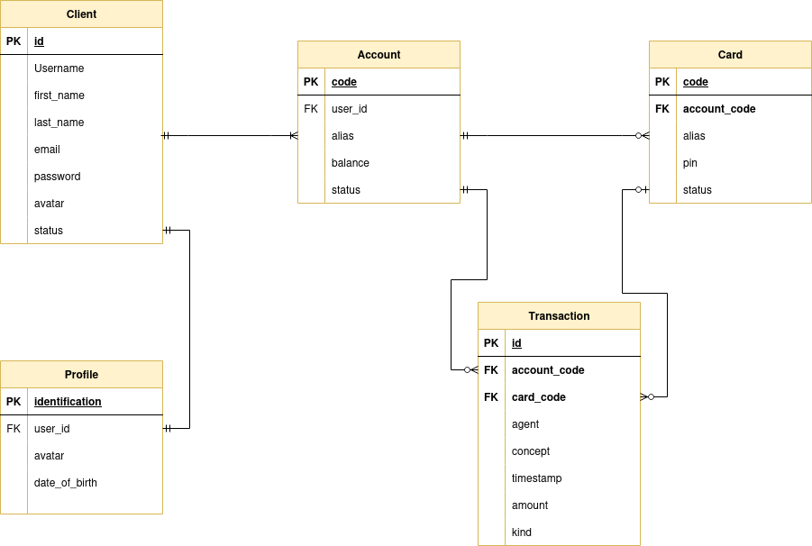

# Adabank
<div align="center">

</div>
<br>
Repository dedicated to the development of a banking application with Django. We will implement everything related to user management, including registration, login, profile editing and password change and recovery. As for the bank part, we will implement an incoming and outgoing money transfer system and a card payment system. On the other hand, we will also allow the user to consult his movements and to be able to create or consult new cards or bank accounts and some more functionalities.

## Entity-relationship model
<div align="center">

</div>  

> 🔒 Client password and Card pin will be stored on database with hash using django algorithms.


## About objects
### Client and Profile
We will use profile object to extend the user auth model of django. The profile will conatin identification, date of birth and avatar for the user because these are not in the Django auth user model. This Profile object will be useful to implement a custom authentication backend that allows clients to log in with identification. A client can have only one Profile and Profile will only belong to a sinlge client

### Account
This object will be in charge of controlling the money in the clients' accounts. In addition, the client will be able to assign them an alias for the display of their accounts. A single client can create multiple bank accounts (account objects)
Regarding the account code, it will have an identifier at the beginning in the style "A1" and will continue with 4 numbers that will be correlatively assigned: 
- A1-0001
- A1-0002
- A1-0003
- A1-0004

### Card
The card object will be related to bank accounts and will allow card payments. The card will also have an alias and a pin that will be the password that will allow payments to be made. An account can create multiple cards but the card will be only related to a single account.  
The card code will be correlatively assigned and does not have to match the account number:
- C1-0001
- C1-0002
- C1-0003
- C1-0004

### Transaction
The transaction object is the main object that will manage all payments, transfers and anything related to flow of money. It contains the agent sending or requesting the money, the concept or reason for the transaction, a field for assigning the time and the required amount. All the transaction objects will be related to an account so we can show the client all the operations made on their account. A resume of transaction:
- Transfers:
    - Incoming transfers
    - Outcoming transfers

- Payment:
    - Card payment

### Status
In the bank, there will be 3 possible states: 
- Active: Allow to use all functionalities on the bank app
- Blocked: Restrict some of the functionalities related to transfers and payments
- Disabled: Restrict all the functionalities, even the login for the client


## Setup  
To develop the bank app, we will need some requirements to process and modify images, to protect sensitive data on a .env file and to make request to simulate a card payment so we will use python virtual enviroments.
```console
$ python -m venv .venv --prompt bank
$ source .venv/bin/activate
$ pip install -r requirements.txt
```
> NOTE💡: requirements.txt is a file with all the project requirements so we can install all of them on a single command  

A `.env` file will be needed to keep save some data as passwords, mail settings, some database configurations... This file will allow the application to use the data but not load it into version control. Remember to import prettyconf (after installing requirements) and using on the app the config method with the name of the variable to search for in the `.env`.  

It is important to check the `.gitignore` file so that the database (`db.sqlite3`), the `.env` file, the `media` folder with photos of the clients and the virtual environment (`.venv`) are not uploaded to version control.

## Extra files
To streamline some repetitive processes on terminal we are using [Justfile](https://github.com/casey/just), a handy way to run and save commands. You can find the installation process on the [documentation of justfile on github](https://github.com/casey/just#installation). We can do a lot of things on a justfile but a simple example is:  

Instead of runing the command:   
```console
python manage.py runserver
```
Justfile allows us to run:
```console
just runserver
```  
> [Our justfile](./bank/justfile)

